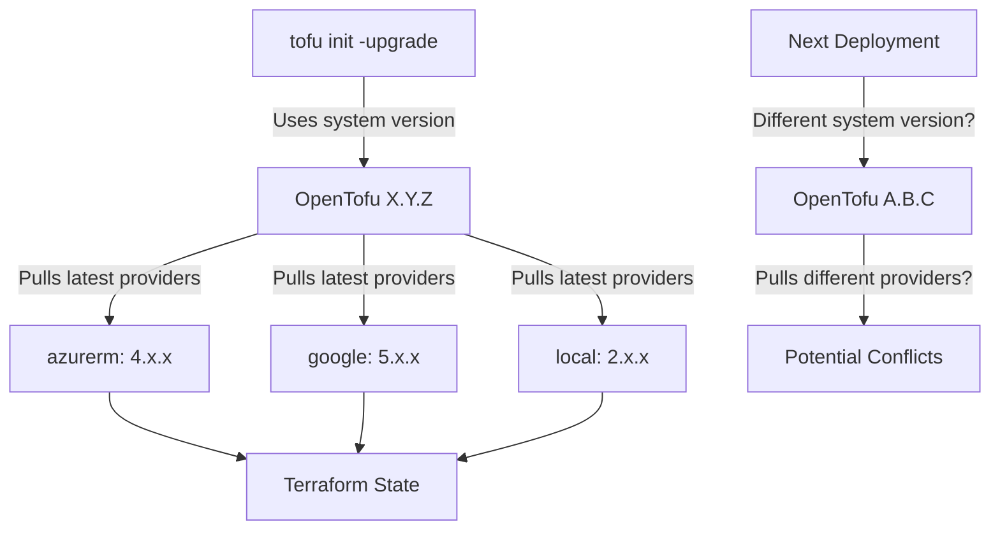

# OpenTofu/Terraform Version Audit Report
**Sunbird Spark Installer - GitHub Action**

**Report Generated:** 2026-03-11
**Repository:** `sunbird-spark-installer`
**IaC Tool:** OpenTofu (Terraform-compatible)

---

## Executive Summary

This audit analyzes the version constraints and deployment version of OpenTofu/Terraform across the Sunbird Spark Installer repository.

### Key Findings:

- **OpenTofu Binary Used:** Yes (detected in `install.sh`)
- **Runtime Version Pinning:** ❌ **NOT PINNED** - Uses system-available version
- **Provider Lock Files:** ⚠️ **EMPTY** - `.opentofu.lock.hcl` files exist but are unpopulated
- **Root Module Version Constraint:** ❌ **MISSING** - No `required_version` at root level
- **Provider Version Constraints:** ✅ **PARTIAL** - 11 out of 16 modules define constraints
- **Risk Level:** 🔴 **HIGH** - Version unpredictability across deployments

---

## 1. Repository Summary

| Metric | Count |
|--------|-------|
| **Total Modules** | 16 |
| **Modules with Version Constraints** | 11 |
| **Modules WITHOUT Constraints** | 5 |
| **Unique Providers** | 6 |
| **Lock Files (empty)** | 2 |
| **CI/CD with Version Pinning** | 0 |

### Module Breakdown:
- **Azure Infrastructure Modules:** 7 (AKS, Network, Storage, Keys, Output, Upload, Random)
- **GCP Infrastructure Modules:** 8 (GKE, Network, Service Account, Storage, Keys, Output, Upload, Random)
- **Addon Modules:** 1 (DIAL Azure Storage)

---

## 2. Module Version Constraint Table

| Module Path | required_version | Providers | Lock File | Status |
|---|---|---|---|---|
| `opentofu/azure/modules/aks` | None | azurerm: ~> 4.0 | ❌ | ⚠️ Constraint defined, not locked |
| `opentofu/azure/modules/network` | None | azurerm: ~> 4.0 | ❌ | ⚠️ Constraint defined, not locked |
| `opentofu/azure/modules/storage` | None | azurerm: ~> 4.0 | ❌ | ⚠️ Constraint defined, not locked |
| `opentofu/azure/modules/output-file` | None | local: ~> 2.5<br/>null: ~> 3.2 | ❌ | ⚠️ Constraint defined, not locked |
| `opentofu/azure/modules/upload-files` | None | local: ~> 2.5<br/>null: ~> 3.2 | ❌ | ⚠️ Constraint defined, not locked |
| `opentofu/azure/modules/random_passwords` | None | local: ~> 2.5<br/>random: ~> 3.6<br/>null: ~> 3.2 | ❌ | ⚠️ Constraint defined, not locked |
| `opentofu/azure/modules/keys` | None | (implicit tls) | ❌ | ❌ **No constraints** |
| `opentofu/gcp/modules/gke` | None | (implicit google) | ❌ | ❌ **No constraints** |
| `opentofu/gcp/modules/network` | None | (implicit google) | ❌ | ❌ **No constraints** |
| `opentofu/gcp/modules/service-account` | None | (implicit google) | ❌ | ❌ **No constraints** |
| `opentofu/gcp/modules/storage` | None | (implicit google) | ❌ | ❌ **No constraints** |
| `opentofu/gcp/modules/upload-files` | None | (implicit local) | ❌ | ❌ **No constraints** |
| `opentofu/gcp/modules/output-file` | None | (implicit local) | ❌ | ❌ **No constraints** |
| `opentofu/gcp/modules/random_passwords` | None | google: ~> 5.0 | ❌ | ⚠️ Constraint defined, not locked |
| `opentofu/gcp/modules/keys` | None | (implicit tls) | ❌ | ❌ **No constraints** |
| `addons/dial/opentofu/azure/storage` | None | azurerm: ~> 4.0.1<br/>null: ~> 3.2 | ❌ | ⚠️ Constraint defined, not locked |

---

## 3. Provider Version Constraints Summary

### Azure (azurerm)
- **Modules Using:** 4 root modules + 1 addon
- **Constraint Versions:**
  - `~> 4.0` - AKS, Network, Storage (3 modules)
  - `~> 4.0.1` - DIAL addon (stricter patch version)
- **⚠️ Inconsistency:** DIAL addon uses `~> 4.0.1` while main modules use `~> 4.0`
- **Implications:** Could cause compatibility issues when DIAL addon is deployed alongside main modules

### Google Cloud (google)
- **Modules Using:** 5 GCP modules (4 implicitly, 1 explicit)
- **Constraint Versions:**
  - `~> 5.0` - GCP random_passwords module only
  - *Implicit* - GKE, Network, Service Account, Storage modules
- **⚠️ Risk:** GCP modules don't declare google provider constraints; they rely on:
  - Inherited/default provider config
  - System-installed google provider version
  - No guarantee of version consistency

### Utility Providers

| Provider | Constraint | Modules | Risk |
|---|---|---|---|
| `local` | `~> 2.5` | 4 modules | ✅ Consistent |
| `random` | `~> 3.6` | 2 modules | ✅ Consistent |
| `null` | `~> 3.2` | 3 modules | ✅ Consistent |
| `tls` | **NONE** | 2 modules | 🔴 HIGH - Latest version always used |

---

## 4. Runtime Version Detection

### How OpenTofu is Invoked

**File:** `opentofu/azure/template/install.sh` (line 23)
**File:** `opentofu/gcp/template/install.sh` (similar)

```bash
function create_tf_resources() {
    source tf.sh
    echo -e "\nCreating resources on azure cloud"
    tofu init -upgrade          # ← OpenTofu binary called directly
    terragrunt init -upgrade    # ← Terragrunt also used
    terragrunt run-all apply --terragrunt-non-interactive
    chmod 600 ~/.kube/config
}
```

### Version Specification
- **Binary:** `tofu` (OpenTofu)
- **Version Pinning:** ❌ **NONE** - System-installed version used
- **Flag:** `-upgrade` flag causes provider versions to be updated to latest during `tofu init`

### Deployment Method
- **Runner:** Bash script (no Docker/container isolation)
- **Environment:** Depends on system where script runs
- **CI/CD:** No explicit CI/CD pipeline detected with version pinning
- **Only Workflow:** `.github/workflows/build-push-images.yml` (for Docker builds, not OpenTofu)

### ⚠️ Critical Issue:
The `-upgrade` flag in `tofu init -upgrade` will:
1. Download the latest minor/patch versions of providers
2. Potentially pull incompatible provider versions
3. Cause non-deterministic deployments across different runs

---

## 5. Lock Files Analysis

### Current State

```
✅ File exists: opentofu/azure/template/.opentofu.lock.hcl
✅ File exists: opentofu/gcp/template/.opentofu.lock.hcl
⚠️  Content: EMPTY (only header comments present)
```

### What Lock Files Should Contain

Lock files maintain **provider version pins** across deployments:

```hcl
# Example: What should be in .opentofu.lock.hcl
provider "registry.opentofu.org/hashicorp/azurerm" {
  version     = "4.2.1"
  constraints = "~> 4.0"
  hashes = [
    "h1:abc123...",
    ...
  ]
}
```

### Current Problem

- **Empty lock files** mean:
  - No provider version pins exist
  - Each `tofu init -upgrade` pulls the latest provider versions
  - Deployments are non-deterministic and unpredictable
  - Two identical code runs may use different provider versions

---

## 6. Effective Deployment Version

### Summary

| Component | Value | Status |
|---|---|---|
| **OpenTofu Binary** | System-installed `tofu` command | ⚠️ Unpinned |
| **OpenTofu Version** | Unknown (>= 1.0) | 🔴 **CRITICAL** |
| **Provider Versions** | Latest satisfying constraints | ⚠️ Uncontrolled |
| **Locked Versions** | None (lock files empty) | ❌ Not in use |

### What Will Happen During Deployment



### Compatibility Assessment

**Current Status:** 🔴 **HIGH RISK**

| Scenario | Compatibility | Likelihood |
|---|---|---|
| **Same environment, same day** | ✅ Compatible | High |
| **Different developer machines** | ⚠️ Maybe compatible | Medium |
| **Different CI/CD runners** | ❌ Likely incompatible | High |
| **After provider releases** | ⚠️ Possible breaking changes | Medium |

---

## 7. Risks and Issues

### 🔴 HIGH SEVERITY

#### 1. No Root Module `required_version` Constraint
- **Impact:** Any OpenTofu version >= 1.0 could be used
- **Risk:** Syntax compatibility, provider API differences
- **Example:** OpenTofu 1.5 vs 1.8 may have different behavior
- **Mitigation:** Add terraform block to root modules:
  ```hcl
  terraform {
    required_version = ">= 1.5.0, < 2.0"
  }
  ```

#### 2. `-upgrade` Flag Causes Uncontrolled Provider Updates
- **Impact:** Each deployment may use different provider versions
- **Risk:** Breaking changes between provider versions
- **Example:** Azurerm ~4.0 spans 4.0 to 4.99 (many breaking changes possible)
- **Mitigation:** Remove `-upgrade` flag, use lock files instead

### ⚠️ MEDIUM SEVERITY

#### 3. Empty Lock Files
- **Impact:** Provider versions are not reproducible
- **Risk:** Deployments fail with newer provider versions
- **Files:**
  - `opentofu/azure/template/.opentofu.lock.hcl` (empty)
  - `opentofu/gcp/template/.opentofu.lock.hcl` (empty)
- **Mitigation:** Run `tofu init` and commit lock files

#### 4. Inconsistent Provider Constraints
- **Impact:** DIAL addon requires azurerm ~> 4.0.1, but main modules allow 4.0.0
- **Risk:** DIAL may not deploy if 4.0.0 version is locked
- **Files:**
  - `opentofu/azure/modules/aks` - `~> 4.0`
  - `opentofu/azure/modules/network` - `~> 4.0`
  - `addons/dial/opentofu/azure/storage` - `~> 4.0.1` ← Stricter
- **Mitigation:** Align all to `~> 4.0` or validate compatibility

#### 5. Implicit Provider Dependencies (GCP Modules)
- **Impact:** No declared provider version constraints
- **Modules Affected:**
  - `opentofu/gcp/modules/gke` - uses google implicitly
  - `opentofu/gcp/modules/network` - uses google implicitly
  - `opentofu/gcp/modules/service-account` - uses google implicitly
  - `opentofu/gcp/modules/storage` - uses google implicitly
  - `opentofu/gcp/modules/upload-files` - uses local implicitly
  - `opentofu/gcp/modules/output-file` - uses local implicitly
- **Risk:** Latest provider version always used, no version control
- **Mitigation:** Add explicit terraform blocks with required_providers

### 🟡 LOW SEVERITY

#### 6. TLS Provider - No Version Constraint
- **Modules:**
  - `opentofu/azure/modules/keys`
  - `opentofu/gcp/modules/keys`
- **Impact:** Latest tls provider always used
- **Risk:** Minor—tls provider is relatively stable
- **Mitigation:** Add constraint like `~> 4.0`

#### 7. No CI/CD Version Pinning
- **Impact:** Deployment depends on system-installed OpenTofu
- **Risk:** Inconsistent versions across developers and CI systems
- **Mitigation:** Use Docker image with pinned OpenTofu version

---

## 8. Recommendations

### 🎯 IMMEDIATE ACTIONS (Priority 1)

#### Action 1: Add Root Module Terraform Block

**Azure Template:** `opentofu/azure/template/main.tf` (create if doesn't exist)

```hcl
terraform {
  required_version = ">= 1.5.0, < 2.0"

  required_providers {
    azurerm = {
      source  = "hashicorp/azurerm"
      version = "~> 4.0"
    }
    local = {
      source  = "hashicorp/local"
      version = "~> 2.5"
    }
    random = {
      source  = "hashicorp/random"
      version = "~> 3.6"
    }
    null = {
      source  = "hashicorp/null"
      version = "~> 3.2"
    }
    tls = {
      source  = "hashicorp/tls"
      version = "~> 4.0"
    }
  }
}
```

**GCP Template:** `opentofu/gcp/template/main.tf` (create if doesn't exist)

```hcl
terraform {
  required_version = ">= 1.5.0, < 2.0"

  required_providers {
    google = {
      source  = "hashicorp/google"
      version = "~> 5.0"
    }
    local = {
      source  = "hashicorp/local"
      version = "~> 2.5"
    }
    random = {
      source  = "hashicorp/random"
      version = "~> 3.6"
    }
    null = {
      source  = "hashicorp/null"
      version = "~> 3.2"
    }
    tls = {
      source  = "hashicorp/tls"
      version = "~> 4.0"
    }
  }
}
```

#### Action 2: Initialize and Commit Lock Files

```bash
# For Azure
cd opentofu/azure/template
tofu init  # WITHOUT -upgrade flag
git add .opentofu.lock.hcl
git commit -m "Add OpenTofu provider lock file for Azure template"

# For GCP
cd ../../gcp/template
tofu init  # WITHOUT -upgrade flag
git add .opentofu.lock.hcl
git commit -m "Add OpenTofu provider lock file for GCP template"
```

#### Action 3: Update Install Scripts

**Remove `-upgrade` flag from install.sh files:**

**Before (Azure):**
```bash
tofu init -upgrade
terragrunt init -upgrade
```

**After:**
```bash
tofu init
terragrunt init
```

**Rationale:**
- `-upgrade` forces latest provider versions, overriding lock files
- Lock files provide reproducible deployments
- Use `-upgrade` only during intentional provider upgrades

#### Action 4: Standardize Provider Constraints

**Align DIAL addon constraint with main modules:**

**File:** `addons/dial/opentofu/azure/storage/main.tf`

**Change from:**
```hcl
version = "~> 4.0.1"
```

**Change to:**
```hcl
version = "~> 4.0"
```

**Reason:** Main modules allow 4.0.x, DIAL should too for compatibility

---

### 📋 MEDIUM-TERM IMPROVEMENTS (1-2 weeks)

1. **Add explicit terraform blocks to all GCP modules:**
   - `opentofu/gcp/modules/gke/main.tf`
   - `opentofu/gcp/modules/network/main.tf`
   - `opentofu/gcp/modules/service-account/main.tf`
   - `opentofu/gcp/modules/storage/main.tf`
   - `opentofu/gcp/modules/upload-files/main.tf`
   - `opentofu/gcp/modules/output-file/main.tf`

2. **Create centralized versions.tf:**
   - Define all provider constraints in a single `opentofu/versions.tf` file
   - Reference from all modules for consistency

3. **Implement validation:**
   - Add `tofu validate` check in pre-commit hooks
   - Validate constraint compatibility

4. **Document provider policy:**
   - Create `docs/PROVIDER_VERSION_POLICY.md`
   - Define upgrade procedures
   - Document compatibility matrix

5. **Enable CI/CD validation:**
   - Add GitHub Actions workflow to validate terraform configuration
   - Run `tofu validate` on pull requests
   - Check lock file consistency

---

### 🚀 LONG-TERM STRATEGY (1-3 months)

1. **Docker-based deployments:**
   ```dockerfile
   FROM ghcr.io/opentofu/opentofu:1.7.2  # Pinned version
   COPY . /app
   WORKDIR /app
   ```

2. **Provider registry:**
   - Publish modules to Terraform Registry or similar
   - Implement semantic versioning (v1.0.0, v1.1.0, etc.)

3. **Infrastructure as Code best practices:**
   - Workspace separation (dev/staging/prod)
   - State file management and locking
   - Provider upgrade testing process

4. **Version policy document:**
   - OpenTofu version: upgrade quarterly
   - Providers: upgrade monthly with testing
   - Lock files: committed to repository
   - Breaking changes: documented and tested

---

## 9. Implementation Checklist

- [ ] Create `opentofu/azure/template/main.tf` with terraform block
- [ ] Create `opentofu/gcp/template/main.tf` with terraform block
- [ ] Run `tofu init` in both template directories (no `-upgrade`)
- [ ] Commit `.opentofu.lock.hcl` files to repository
- [ ] Update `install.sh` files to remove `-upgrade` flag
- [ ] Align DIAL addon azurerm constraint to `~> 4.0`
- [ ] Add terraform blocks to all GCP modules
- [ ] Create validation in pre-commit hooks
- [ ] Add GitHub Actions workflow for validation
- [ ] Document provider version policy
- [ ] Test deployment with locked provider versions

---

## 10. Appendix: Provider Version Ranges

### Semantic Versioning Syntax

| Constraint | Examples | Allows |
|---|---|---|
| `~> 4.0` | azurerm ~> 4.0 | 4.0.0 to 4.999.x |
| `~> 4.0.1` | azurerm ~> 4.0.1 | 4.0.1 to 4.0.999 |
| `>= 4.0` | azurerm >= 4.0 | 4.0.0 and higher |
| `>= 1.5.0, < 2.0` | terraform >= 1.5.0, < 2.0 | 1.5.0 to 1.999.999 |

### Current Constraint Analysis

**Tightest Constraint:** `~> 4.0.1` (DIAL addon - 0.0.x patch range)
**Loosest Constraint:** `~> 5.0` (google - 0.x.x minor range)
**Most Consistent:** `local` (~> 2.5) across all 4 modules
**Least Consistent:** Google provider (mostly implicit)

---

## 11. Summary & Conclusion

### Current State: 🔴 **HIGH RISK**

The Sunbird Spark Installer uses OpenTofu with:
- ✅ Provider-level constraints (mostly defined)
- ❌ No OpenTofu version constraint
- ❌ Empty lock files
- ⚠️ Implicit dependencies (GCP modules)
- 🔴 `-upgrade` flag causing non-deterministic deployments

### Effective Deployment Version: **UNKNOWN**

**Answer to "What version runs in production?"**
- OpenTofu: System-installed version (any >= 1.0)
- Providers: Latest satisfying constraints (due to `-upgrade` flag)
- Reproducibility: **NOT GUARANTEED**

### Path to Production Readiness

1. **Immediate (1 day):** Add root module terraform blocks + remove `-upgrade` flag
2. **Short-term (1 week):** Commit lock files, standardize constraints
3. **Medium-term (1-2 weeks):** Add GCP module constraints, CI/CD validation
4. **Long-term (1-3 months):** Docker-based deployment, version policy, registry

### Risk Mitigation Priority

1. **CRITICAL:** Define `required_version` at root
2. **HIGH:** Remove `-upgrade` flag, commit lock files
3. **MEDIUM:** Standardize provider constraints
4. **LOW:** Pin OpenTofu version in CI/CD

---

**Report prepared by:** DevOps IaC Audit
**Date:** 2026-03-11
**Status:** Version constraints identified, recommendations provided
